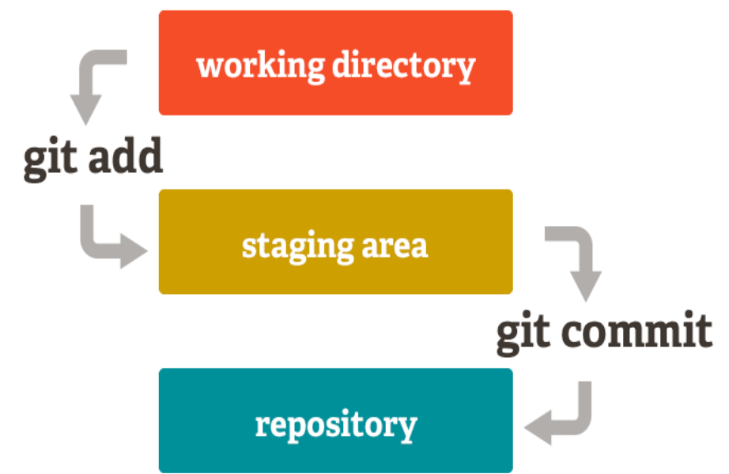

# Git Add

```bash
git add README.md
```

The `git add` command adds a change in the working directory to the staging area. It tells Git that you want to include updates to a particular file in the next commit. However, changes are not actually recorded until you run `git commit`.



### When do you use `git add`?


As you're working, you change and save a file, or multiple files. Then, before you commit, you must `git add`. This step allows you to choose what you are going to commit. Commits should be logical, atomic units of change - but not everyone works that way. Maybe you are making changes to files that _aren't_ logical or atomic units of change.  `git add` allows you to systematically shape your commits and your history anyway.

## The staging area

The primary function of the `git add` command, is to promote pending changes in the working directory, to the 'git staging' area. It helps to think of it as a buffer between the working directory and the project history.

Instead of committing all of the changes you've made since the last commit, the stage lets you group related changes into highly focused snapshots before actually committing it to the project history. This means you can make all sorts of edits to unrelated files, then go back and split them up into logical commits by adding related changes to the stage and commit them piece-by-piece. As in any revision control system, it’s important to create atomic commits so that it’s easy to track down bugs and revert changes with minimal impact on the rest of the project.
`git add [filename]` selects that file, and moves it to the staging area, marking it for inclusion in the next commit. You can select all files, a directory, specific files, or even specific parts of a file for staging and commit.

This means if you `git add` a deleted file the _deletion_ is staged for commit. The language of "add" when you're actually "deleting" can be confusing.

### Common usages and options for `git add`

* `git add <path>`: Stage a specific directory or file
* `git add .`: Stage all files (that are not listed in the `.gitignore`) in the entire repository
* `git add -p`: Interactively stage hunks of changes

You can see the options of `git add` in [git-scm's documentation](https://git-scm.com/docs/git-add).

## Example use of `git add`

`git add` usually fits into the workflow in the following steps:

1. Create a branch: `git branch update-readme`
2. Checkout to that branch: `git checkout update-readme`
3. Change a file or files
4. Save the file or files
5. Add the files or segments of code that should be included in the next commit: `git add README.md`
6. Commit the changes: `git commit -m "update the README to include links to contributing guide"`
7. Push the changes to the remote branch: `git push -u origin update-readme`

But, `git add` could also be used like:

1. Create a branch: `git branch update-readme`
2. Checkout to that branch: `git checkout update-readme`
3. Change a file or files
4. Save the file or files
5. Add only one file, or one part of the changed file: `git add README.md`
6. Commit the first set of changes: `git commit -m "update the README to include links to contributing guide"`
7. Add another file, or another part of the changed file: `git add CONTRIBUTING.md`
8. Commit the second set of changes: `git commit -m "create the contributing guide"`
9. (Repeat as necessary)
10. Push the changes to the remote branch: `git push -u origin update-readme`

### `git add` All Files

Staging all available files is a popular, though risky, operation. This can save time, but the risks are two-fold:

#### Poorly thought out history

By staging all available changes, the clarity of your history will likely suffer. Being able to shape your history is one of the greatest advantages of using Git. If your commits are too large, contain unrelated changes, or are unclearly described in the commit message, you will lose the benefits of viewing and changing history.

#### Accidentally staging and committing files

By using an option to add all files at once, you may accidentally stage and commit a file. Most common flags don't add files tracked in the `.gitignore` file. But, any file not listed in the `.gitignore` file will be staged and committed. This applies to large binary files, and files containing sensitive information like passwords or authentication tokens.

#### Deciding to stage all files

If the time is right to stage all files, there are several commands that you can choose from. As always, it's very important to know what you are staging and committing.

* `git add -A`: stages all files, including new, modified, and deleted files, including files in the current directory _and_ in higher directories that still belong to the same git repository
* `git add .`: adds the entire directory recursively, including files whose names begin with a dot
* `git add -u`: stages modified and deleted files only, NOT new files

| | New files | Modified files | Deleted files | Files with names beginning with a dot | Current directory | Higher directories|
| ------------- | ------------- | ---- | ---- | ------ | ----- | ----- |
| `git add -A ` | Yes | Yes | Yes | Yes | Yes | Yes |
| `git add .` | Yes | Yes | Yes | Yes | Yes | No |
| `git add -u` | No | Yes | Yes | Yes | Yes | Yes |

### `git add` A Folder or Specific File

The safest and clearest way to use `git add` is by designating the specific file or directory to be staged. The syntax for this could look like:

`git add directory/`: Stage all changes to all files within a directory titled `directory`
`git add README.md`: Stage all changes within the `README.md` file

### Undo Added Files

Before undoing a `git add`, you should first be sure that you won't lose any work. There's no way to "revert" an add in the same way you can revert a commit, but you can move the files out of the staging area. 

For example, if you have a staged file, and then you make more changes to that file in your working directory. Now, the versions in your working directory and your staging area are different. If you take action to remove the changed version of the file from the staging area, the changes that were in your working directory _but not_ staged will be overwritten.

To avoid this, first stage all changes, then unstage them together, or commit the changes and reset back before the commit happened.

#### Using `git reset` to undo `git add`

`git reset` is a flexible command. One of its many use cases is to move changes _out_ of the staging area. To do this, use the "mixed" level of reset, which is the default.

To move staged changes from the staging area to the working directory without affecting committed history, first make sure that you don't have any additional changes to the files in question as mentioned above. Then, type `git reset HEAD` (aka `git reset --mixed HEAD`).

## Related Terms

- `git status`: Always a good idea, this command shows you what branch you're on, what files are in the working or staging directory, and any other important information.
- `git checkout [branch-name]`: Switches to the specified branch and updates the working directory.
- `git commit -m "descriptive message"`: Records file snapshots permanently in version history.
- `git push`: Uploads all local branch commits to the remote.
